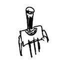
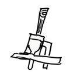

# SchwurblerControllers

SchwurblerControllers is an Arduino library to easily setup a different Controller for your Midi Controller

## How to use

### Include the Controllers
include all you want to use

#### Buttons


_Triggervalue on/off_
- ButtonController
```Arduino
#include <ButtonController.h>
```

#### Potentiometer

- PotiController

_analog Value_
```Arduino
#include <PotiController.h>
```

#### Rotary Encoder

- RotaryController

_digital angle Value_

_not ready to use now_
```Arduino
#include <RotaryController.h>
```

### Define your Controller
Outside of the setup and loop functions you define but do not initialze all your controllers.
We need to define a pointer variable from the descired Controllers. 
```Arduino
PotiController* potiController;
```

### Initialize the Controller
Inside the setup function you shall init all your controllers
```Arduino
// Here we define a Controller for Potis but all Controllers but the rest do the same way
potiController = new PotiController(
  3, // We want to use 3 Potis
  {0, 1, 2}, // They should communitate on Midi Key 0, 1 and 2
  {1, 2, 3}); // Their pins are 1, 2 and 3
```
This will result in a setup of 3 Potis
* Poti 1 sends Key 0 listens on Pin 1
* Poti 2 sends Key 1 listens on Pin 2
* Poti 3 sends Key 2 listens on Pin 3

### The controllertype is digital?
You need to loop over the pins to set them as INPUT_PULLUP
As all are already defined you can loop over the controller
```Arduino
for (int controllerID = 0; controllerID < buttonController->getAmount();
      controllerID++) {
  pinMode(buttonController->getPin(controllerID), INPUT_PULLUP);
}
```

###  Invoke a Midi funtion to run as callback
You check which type the Controller awaits and create one with the name of your choise and link that funktionname later to the Controller 
#### Triggerbased Input
create a function to be called with a params
* *int* inControlNumber the Midi key to send
* *bool* isActive desctibes if it's the push or release event
```Arduino
void SendMidiTrigger(int inControlNumber, bool isActive) {
  if (isActive) {
    usbMIDI.sendNoteOn(inControlNumber, kOnVelocity, kMidiChannel);
  } else {
    usbMIDI.sendNoteOff(inControlNumber, 0, kMidiChannel);
  }
}
```
Link the callback to the Controller
```Arduino
buttonController->handleMidiTriggerCallback(&SendMidiTrigger);
```

#### Valuebased Input
create a function to be called with a params
* *int* inControlNumber the Midi key to send
* *byte* the meassured value of the input  
```Arduino
void sendMidiValueChange(int inControlNumber, byte controllerValue) {
  usbMIDI.sendControlChange(inControlNumber, controllerValue, kMidiChannel);
}
```
Link the callback to the Controller
```Arduino
potiController->handleMidiTriggerCallback(&sendMidiValueChange);
```

### Fetch the date in the loop function
```Arduino
buttonController->getData();
```

## Install

like any other Arduino library

## Documentation
see doc

## Project running with this library
[Der Schwurbler](https://github.com/mommel/hs-lr-midi-schwurbler)

### Uses 3rdparty libraries
The controllers use 3rd party libraries, that are not included but marked as dependencies. Those libraries have their own licences and are not touched by the library used by SchwurblerControllers

### Credits
We like to thank dxinteractive for ResponsiveAnalogRead, mathertel for RotaryEncoder and thomasfredericks for Bounce2

## License

This program is free software; you can redistribute it and/or modify
it under the terms of the (CC BY-NC-SA 4 0)
Creative Commons Attribution-NonCommercial-ShareAlike 4 0 International
as published by Creative Commons Corporation; either version 4 of the
License, or (at your option) any later version

DISCLAIMER
THE SOFTWARE IS PROVIDED "AS IS", WITHOUT WARRANTY OF ANY KIND,
EXPRESS OR IMPLIED, INCLUDING BUT NOT LIMITED TO THE WARRANTIES OF
MERCHANTABILITY, FITNESS FOR A PARTICULAR PURPOSE AND NONINFRINGEMENT IN
NO EVENT SHALL THE AUTHORS OR COPYRIGHT HOLDERS BE LIABLE FOR ANY CLAIM,
DAMAGES OR OTHER LIABILITY, WHETHER IN AN ACTION OF CONTRACT, TORT OR
OTHERWISE, ARISING FROM, OUT OF OR IN CONNECTION WITH THE SOFTWARE OR THE
USE OR OTHER DEALINGS IN THE SOFTWARE
